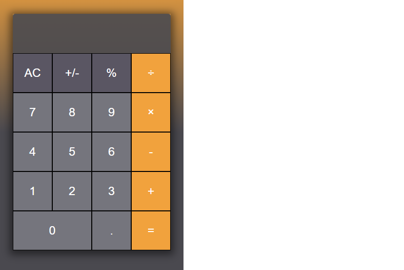

# Calculator  🖩

> Essa é uma calculadora simples feita com a intenção de treinar o Display-Grid e o JavaScript Web.

## 🚀 Technologies
Este projeto foi desenvolvido com as seguintes tecnologias:
    
- HTML
- CSS
- JavaScript
## 🤝 Colaboradores

Agradecemos às seguintes pessoas que contribuíram para este projeto:

<table>
  <tr>
    <td align="center">
      <a href="#">
         
        
          <b>Matheus Santos</b>
        
      </a>
    </td>
    
</table>

## 📝 Licença

Esse projeto está sob licença. Veja o arquivo [LICENÇA](LICENSE.md) para mais detalhes.

[⬆ Voltar ao topo](#nome-do-projeto) 
Made with ♥ by Matheus Santos :wave: <a href="https://www.linkedin.com/in/matheus-santos-souza">Get in touch!</a>